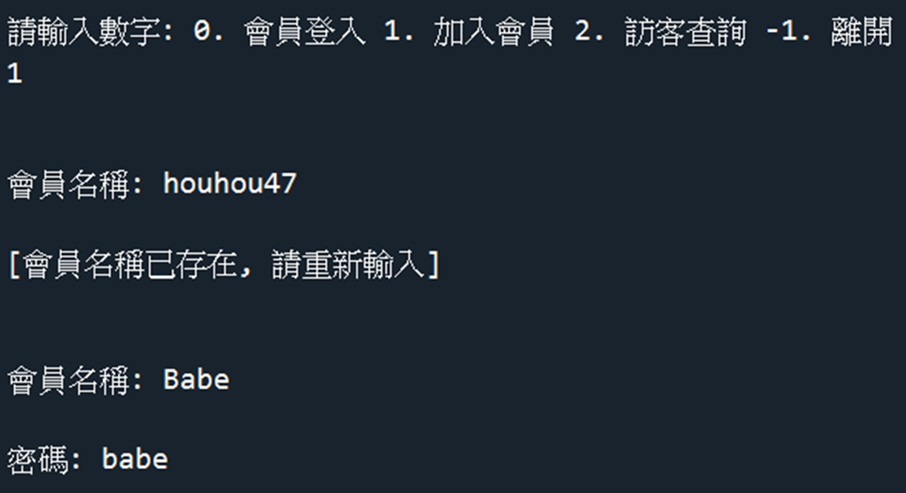
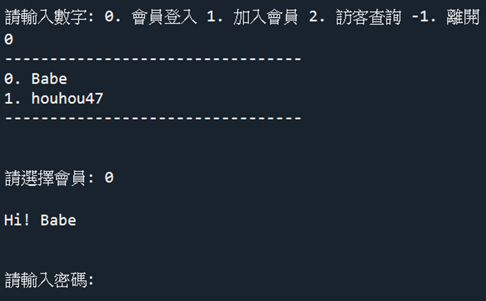
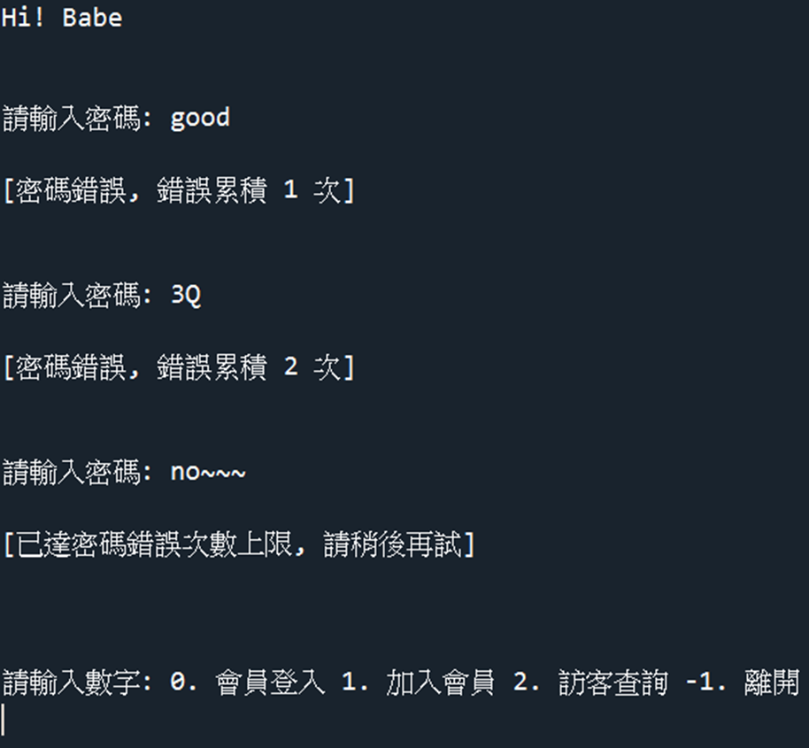
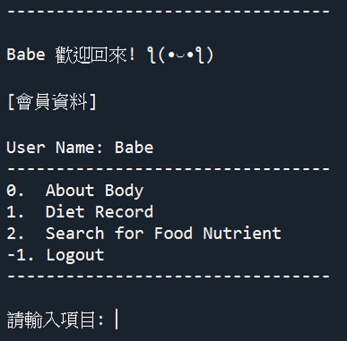
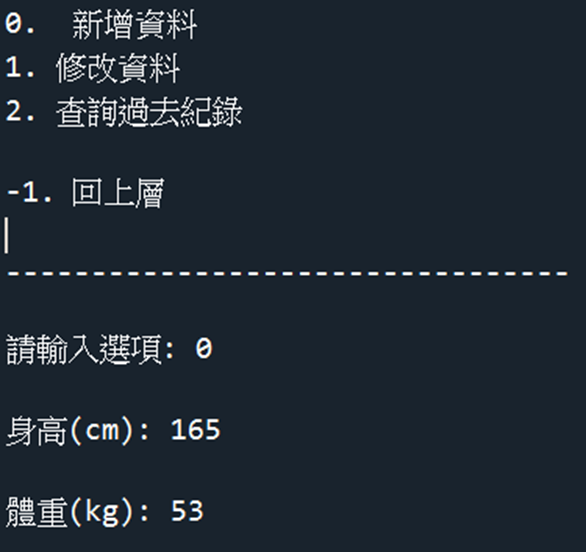
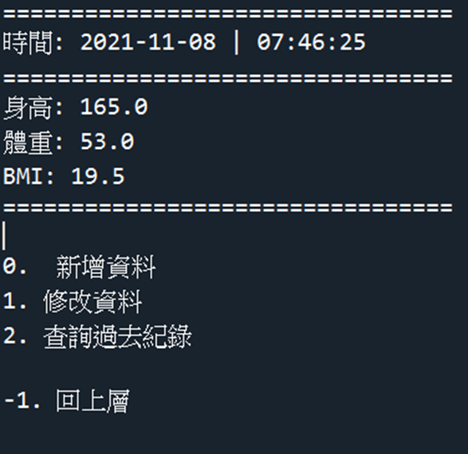
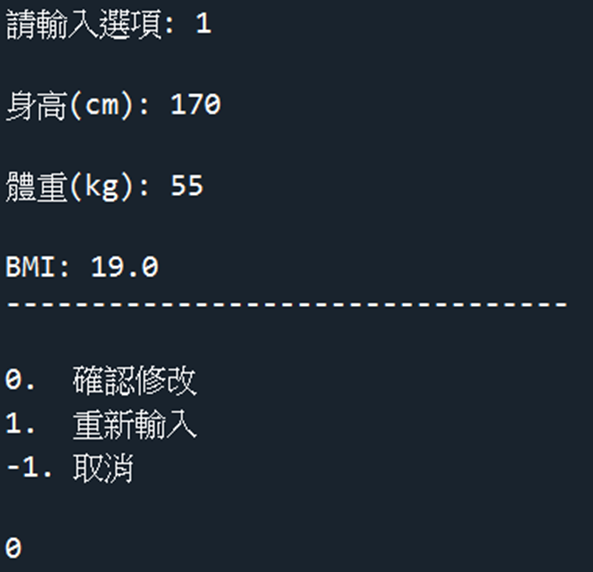

# DietHelper
> - 可查詢食物營養素、登入會員紀錄身高體重與 BMI 變化  
> - 實作語言:  
>| 普通版--`Python`+`SQLite` 
>| 網頁版--`Python`+`SQLite`+`HTML/CSS`+`Django`
> - 網路與資料庫程式設計課程之期中 & 期末專題

## 普通版
### - Execution
  

### - 訪客查詢 by 輸入食品名稱
  

### - 訪客查詢 by 選擇食品類別
  
#### 再選擇目標食品
  

  

  

### - 加入會員
  
### - 會員登入
  
#### 密碼錯誤
  
#### 登入成功
  
### - About Body
  
#### 新增資料
  
#### 新增資料成功(會幫你計算出 BMI)
  
#### 修改資料
  
